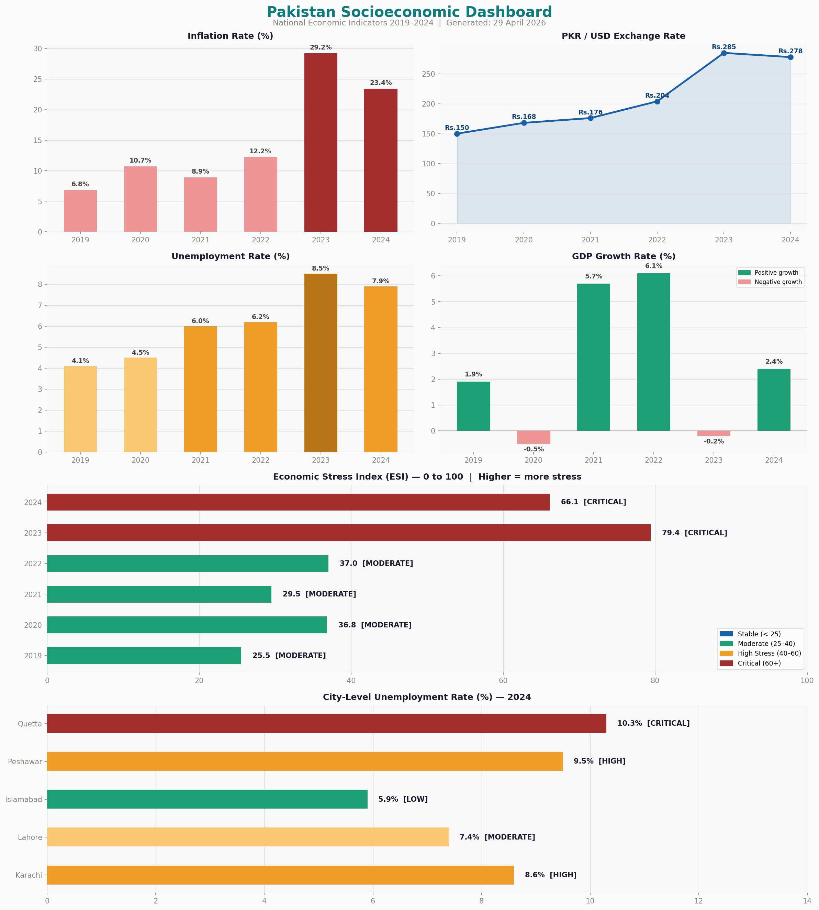

# 🇵🇰 Pakistan Socioeconomic Dashboard

> Visualizing Pakistan's key economic indicators from 2019 to 2024 — built entirely in Python.



---

## 📊 What This Dashboard Shows

| Indicator | Coverage |
|---|---|
| Inflation Rate (%) | 2019–2024, national |
| PKR / USD Exchange Rate | 2019–2024 |
| Unemployment Rate (%) | 2019–2024, national |
| GDP Growth Rate (%) | 2019–2024 |
| Economic Stress Index (ESI) | 2019–2024, composite score |
| City-Level Unemployment | 2024, 5 major cities |

---

## 🔍 Key Findings

- **Inflation** peaked at **29.2%** in 2023, up from just 6.8% in 2019
- **PKR** depreciated from Rs.150 to Rs.285 per USD — a ~90% decline in 5 years
- **Unemployment** nearly doubled from 4.1% (2019) to 8.5% (2023)
- **Economic Stress Index** hit a critical **79.4 in 2023**, easing slightly to 66.1 in 2024
- **Quetta** has the highest city-level unemployment at **10.3%**, vs Islamabad's 5.9%
- **2024 shows early signs of stabilization** — inflation down, ESI improving, GDP recovering to 2.4%

---

## 🛠️ Tech Stack

- **Python 3.x**
- **Matplotlib** — all charts and layout
- **Pandas** *(optional, for data handling)*

---

## 🚀 Getting Started

```bash
# Clone the repo
git clone https://github.com/YOUR_USERNAME/pakistan-socioeconomic-dashboard.git
cd pakistan-socioeconomic-dashboard

# Install dependencies
pip install matplotlib pandas

# Run the dashboard
python pakistan_socioeconomic_dashboard.py
```

The script will generate and save `pakistan_dashboard.png` in the same directory.

---

## 📁 File Structure

```
├── pakistan_socioeconomic_dashboard.py   # Main script
├── pakistan_dashboard.png                # Generated dashboard image
└── README.md
```

---

## 📌 Data Sources

Data is based on publicly reported figures from:
- State Bank of Pakistan (SBP)
- Pakistan Bureau of Statistics (PBS)
- World Bank / IMF Pakistan reports

> **Note:** Some figures may be estimates or approximations based on publicly available data at the time of compilation.

---

## 🤝 Contributing

Feel free to open an issue or PR if you'd like to add more indicators, update data, or improve the visual design.

---

## 📄 License

MIT License — free to use, share, and modify with attribution.
